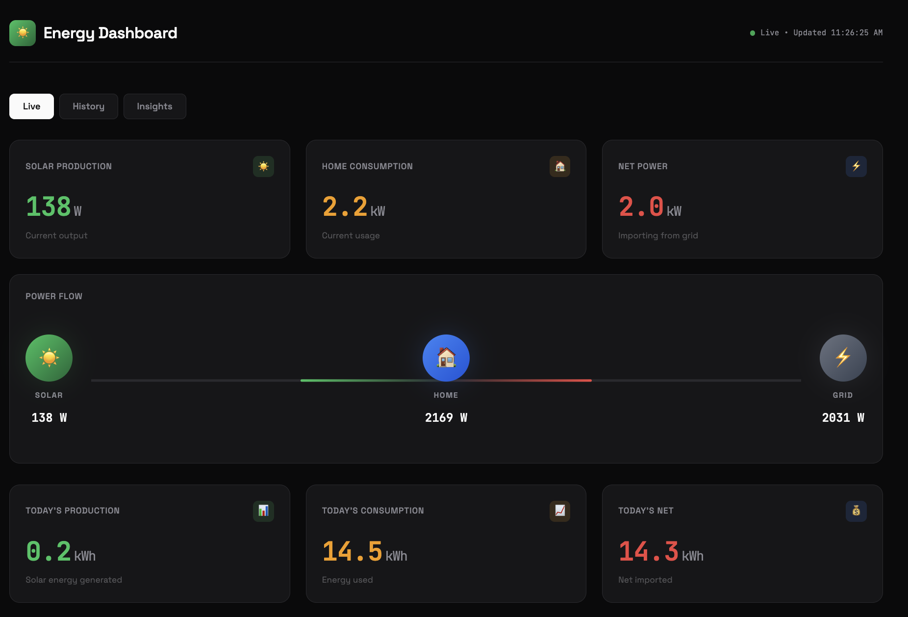

# 🏠 Home Energy Dashboard

A beautiful, real-time energy monitoring dashboard for Home Assistant. Track your solar production, home consumption, and grid usage with animated visualizations.



## Features

- **Real-time monitoring** - See live solar production and home consumption in watts
- **Animated power flow** - Visual representation of energy flowing between solar panels, home, and grid
- **Daily totals** - Track production, consumption, and net energy for the day
- **Historical charts** - View today's energy curve with both solar and consumption data
- **Insights** - Weekly/monthly consumption, voltage readings, and projected usage
- **Dark theme** - Easy on the eyes, looks great on any device
- **Configurable** - Works with different sensor setups via built-in settings UI

## Requirements

- **Home Assistant** with the following integrations:
  - Solar monitoring (tested with Enphase via REST API)
  - Energy monitoring (tested with Sense Energy Monitor)
- A modern web browser

## Quick Start

### Option 1: Host on Home Assistant (Recommended)

1. Download `index.html` from this repo
2. Copy to your Home Assistant config folder:
   ```
   /config/www/energy-dashboard/index.html
   ```
3. Restart Home Assistant
4. Access at: `http://homeassistant.local:8123/local/energy-dashboard/index.html`
5. On first load, enter your HA URL and Long-Lived Access Token

### Option 2: Standalone Hosting

1. Host `index.html` on any web server (Vercel, Netlify, GitHub Pages, etc.)
2. Configure CORS in Home Assistant's `configuration.yaml`:
   ```yaml
   http:
     cors_allowed_origins:
       - https://your-dashboard-url.com
   ```
3. Access the dashboard and enter your HA URL and token

## Configuration

### First-Time Setup

On first load, you'll see a setup modal. Enter:

1. **Home Assistant URL** - e.g., `http://homeassistant.local:8123` (leave empty if hosting on HA)
2. **Long-Lived Access Token** - Create one in HA: Profile → Long-Lived Access Tokens → Create Token

### Sensor Configuration

Click "Advanced: Sensor Configuration" in the setup modal to customize sensor entity IDs:

| Setting | Default | Description |
|---------|---------|-------------|
| Solar Power Sensor | `sensor.enphase_current_power` | Real-time solar production in W |
| Solar Daily Sensor | `sensor.solar_production_today_kwh` | Today's production in kWh |
| Consumption Power Sensor | `sensor.sense_energy` | Real-time consumption in W |
| Consumption Daily Sensor | `sensor.sense_daily_energy` | Today's consumption in kWh |

### Adding to Home Assistant Sidebar

Add this to your `configuration.yaml`:

```yaml
panel_iframe:
  energy_dashboard:
    title: "Energy"
    icon: mdi:solar-power
    url: "/local/energy-dashboard/index.html"
```

Then restart Home Assistant.

## Setting Up Sensors

### Enphase Solar (via REST API)

Add to `configuration.yaml`:

```yaml
rest:
  - resource: "https://api.enphaseenergy.com/api/v4/systems/YOUR_SYSTEM_ID/summary"
    scan_interval: 7200  # 2 hours
    headers:
      Authorization: !secret enphase_access_token
      key: !secret enphase_api_key
    sensor:
      - name: "Enphase Current Power"
        unique_id: enphase_current_power
        value_template: "{{ value_json.current_power | default(0) }}"
        unit_of_measurement: "W"
        device_class: power

template:
  - sensor:
      - name: "Solar Production Today kWh"
        unique_id: solar_production_today_kwh
        unit_of_measurement: "kWh"
        device_class: energy
        state: "{{ (states('sensor.enphase_energy_today') | float(0) / 1000) | round(2) }}"
```

### Sense Energy Monitor

Install the [Sense integration](https://www.home-assistant.io/integrations/sense/) from HACS or the built-in integration. Sensors are created automatically.

### Net Energy Template

Add to `configuration.yaml`:

```yaml
template:
  - sensor:
      - name: "Net Energy Today"
        unique_id: net_energy_today
        unit_of_measurement: "kWh"
        device_class: energy
        state: >
          
          
          {{ (production - consumption) | round(2) }}
```

## Troubleshooting

### "Connection error"
- Verify your Home Assistant URL is correct
- Check that your Long-Lived Access Token is valid
- Open browser console (F12) for detailed error messages

### Data shows "--"
- Verify sensor entity IDs match your Home Assistant setup
- Check Developer Tools → States in HA to confirm sensors exist and have values

### CORS errors (when hosting externally)
- Add your dashboard URL to `cors_allowed_origins` in HA's `configuration.yaml`
- Restart Home Assistant after changing CORS settings

## Customization

### Colors

Edit the CSS variables in `:root` to change the color scheme:

```css
:root {
    --solar: #22c55e;        /* Green for solar */
    --consumption: #f59e0b;  /* Amber for consumption */
    --grid-export: #3b82f6;  /* Blue for export */
    --grid-import: #ef4444;  /* Red for import */
}
```

### Refresh Rate

The dashboard refreshes every 30 seconds by default. To change, modify `refreshInterval` in the CONFIG object (value in milliseconds).

## Contributing

Contributions are welcome! Please feel free to submit a Pull Request.

## License

MIT License - see [LICENSE](LICENSE) file for details.

## Acknowledgments

- Built with [Chart.js](https://www.chartjs.org/) for visualizations
- Fonts: [Space Grotesk](https://fonts.google.com/specimen/Space+Grotesk) and [JetBrains Mono](https://fonts.google.com/specimen/JetBrains+Mono)
- Designed for use with [Home Assistant](https://www.home-assistant.io/)
